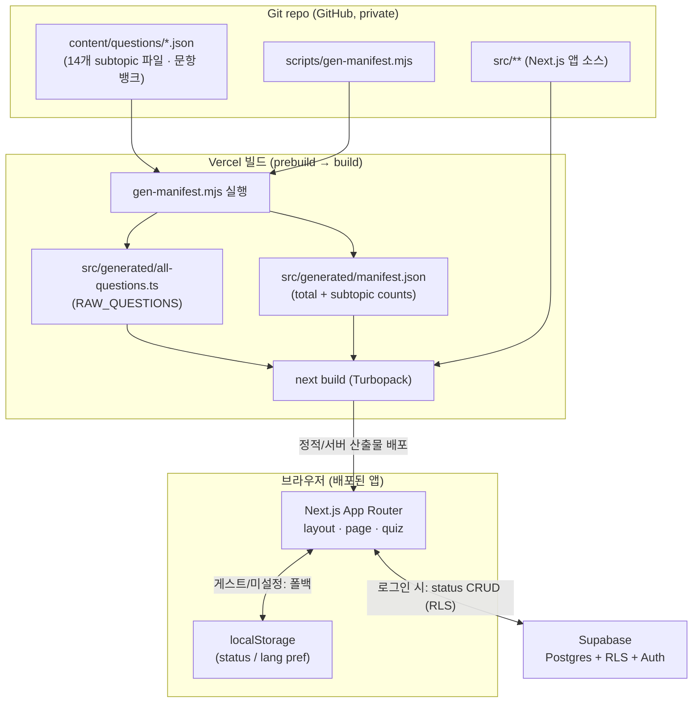
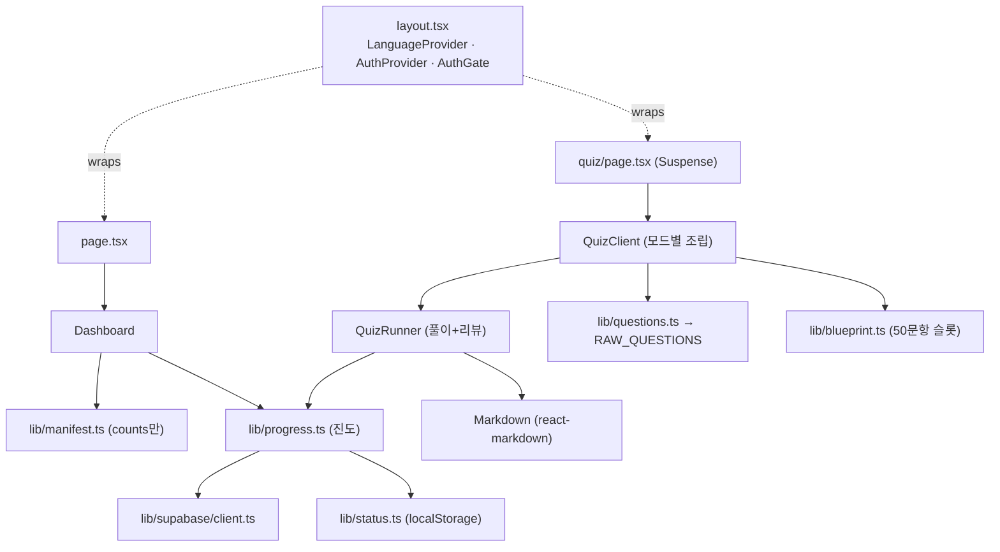
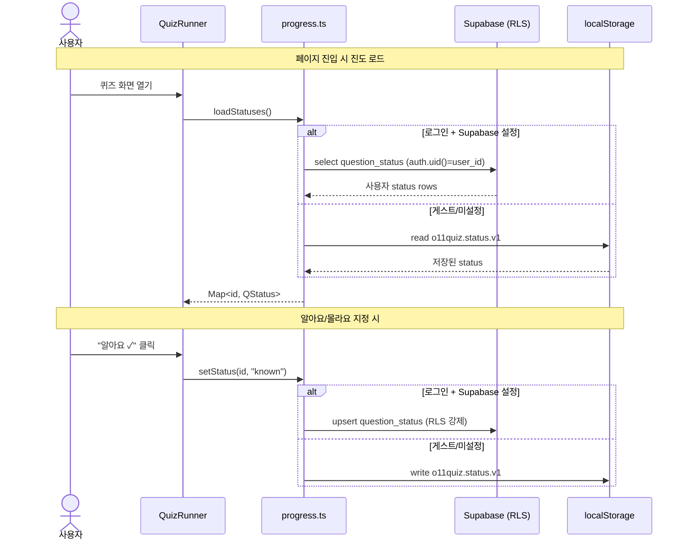

# 시스템 아키텍처 (System Architecture)

> 범위: o11-quiz 웹 앱의 런타임/빌드 아키텍처, 콘텐츠(JSON 번들) 모델, gen-manifest 빌드 파이프라인, 클라이언트 데이터 흐름(Supabase ↔ localStorage), 그리고 계층/컴포넌트 관계를 다룬다. 콘텐츠 생성 파이프라인(문항 뱅크를 만든 LLM 워크플로)이나 개별 문항의 학습 내용은 별도 문서에서 다룬다.

o11-quiz는 OutSystems 11 Associate Reactive Developer(O11) 자격증 대비용 이중언어(한국어/English) 연습문제 웹 앱이다. Concentrix 내부 스터디 그룹을 위한 비공개 학습 도구이며 로그인이 필요하다(자세한 배경은 source brief §1 참조). 이 문서는 "코드가 실제로 어떻게 구성되어 실행되는가"에 집중한다.

아키텍처의 핵심 특징은 두 가지다. 첫째, **문항 콘텐츠는 DB가 아니라 repo의 버전 관리되는 JSON**으로 존재하고 빌드 시점에 앱 번들로 구워진다(brief §17-1). 둘째, **DB(Supabase)는 사용자별 학습 진도(자가진단 status)만** 저장하며, 로그인이 없거나 Supabase가 설정되지 않으면 localStorage로 자연스럽게 폴백한다. 즉 콘텐츠는 정적, 진도는 동적이라는 명확한 이원 구조다.

---

## 1. 기술 스택 요약

| 계층 | 기술 | 근거/버전 |
| --- | --- | --- |
| 프레임워크 | Next.js 16 App Router (Turbopack) | `package.json` `next@16.2.9` |
| UI 런타임 | React 19 | `react@19.2.4`, `react-dom@19.2.4` |
| 언어 | TypeScript 5 | `typescript@^5` (devDep) |
| 스타일 | Tailwind CSS v4 (PostCSS 플러그인) | `tailwindcss@^4`, `@tailwindcss/postcss@^4` |
| Markdown 렌더링 | react-markdown + remark-gfm | `react-markdown@^10`, `remark-gfm@^4` (brief §3) |
| 인증·데이터 | Supabase (Postgres + RLS) | `@supabase/ssr@^0.12`, `@supabase/supabase-js@^2.110` |
| 호스팅 | Vercel (main push 시 자동 배포) | brief §1, §3 |

Next.js 16 특성상 `searchParams`/`params`는 async이며 `useSearchParams`는 `<Suspense>` 경계를 요구한다(brief §3). 이 두 제약은 아래 §4의 라우팅 구조에 직접 반영되어 있다. Turbopack의 workspace root는 `next.config.ts`에서 `turbopack.root = __dirname`으로 고정되어 있는데, 이는 상위(홈) 디렉터리에 있는 우발적 `package-lock.json`이 Next의 workspace root 추론을 잘못 유도하는 문제를 막기 위한 조치다(`next.config.ts` 주석 참조).

---

## 2. 상위 수준 배포·컴포넌트 다이어그램



문항 콘텐츠는 빌드 산출물에 정적으로 포함되므로 런타임에 콘텐츠를 위해 DB나 네트워크를 왕복하지 않는다. 런타임의 네트워크 왕복은 오직 **인증**과 **사용자 진도(status) 동기화**를 위한 Supabase 호출뿐이며, 그마저도 게스트/미설정 환경에서는 localStorage로 대체된다.

---

## 3. 콘텐츠 = JSON 번들 모델

### 3.1 왜 JSON 번들인가

문항은 읽기 전용 편집 콘텐츠이고, DB에는 사용자별 진도만 둔다는 결정(brief §17-1)에 따라, 문항 뱅크는 `content/questions/*.json` 14개 파일(subtopic당 1개)에 산다. 이렇게 하면 git으로 리뷰/버전 관리가 되고, 호스팅이 저렴하며(콘텐츠 조회 쿼리가 없음), 콘텐츠와 코드가 한 번의 배포로 원자적으로 나간다.

### 3.2 문항 스키마 (요지)

각 문항의 형태는 `src/types/question.ts`의 `Question` 타입으로 정의된다(정확한 필드는 해당 파일 참조). brief §5 기준 핵심 필드:

| 필드 | 설명 |
| --- | --- |
| `id`, `category`, `subtopic`, `difficulty`, `tags[]` | 식별·분류 |
| `stem`, `diagram?`, `options[{key:A..D, text}]×4`, `answer:A..D` | 문제 본문/보기/정답 |
| `explanation` | 한국어 Markdown 해설(두 언어 공용) |
| `distractors?` | 오답 근거 (object `{A:..}` 또는 string) |
| `source`, `status`, `verifyNote?` | 출처·상태·검증 메모 |
| `i18n.ko { stem, options×4, diagram? }` | 한국어 현지화 (필드 단위 fallback) |

중요한 규칙 두 가지: (1) `status === "verified"`인 문항만 서비스에 노출되고 `flagged`/`draft`는 repo에 남되 제외된다. (2) 해설(`explanation`)은 한국어로 두 언어가 공용하며, stem/options/diagram만 현지화 대상이다. `i18n.ko`에 특정 필드가 없으면 English 원문으로 필드 단위 폴백한다(brief §5, §11).

---

## 4. 빌드 파이프라인 — gen-manifest

`scripts/gen-manifest.mjs`는 콘텐츠 JSON을 앱이 소비할 수 있는 두 개의 생성 파일로 변환하는 빌드 단계다. `package.json`의 lifecycle script를 통해 **개발/빌드 직전에 자동 실행**된다.

| npm script | 시점 | 동작 |
| --- | --- | --- |
| `predev` | `next dev` 직전 | `node scripts/gen-manifest.mjs` |
| `prebuild` | `next build` 직전 | `node scripts/gen-manifest.mjs` |
| `gen` | 수동 | 동일 스크립트 직접 실행 |

즉 생성 파일이 최신이 아닐 위험 없이 항상 dev/build 전에 새로 만들어진다.

### 4.1 스크립트가 하는 일 (`scripts/gen-manifest.mjs`)

1. `content/questions/`의 모든 `*.json`을 정렬된 순서로 읽는다(`readdir` → `.filter(.json)` → `.sort()`).
2. 모든 문항을 순회하며 **중복 `id` 검사**를 한다 — 중복이면 `throw new Error("Duplicate question id: …")`로 빌드를 실패시킨다.
3. `status !== "verified"`인 문항은 `flagged` 카운터만 올리고 집계에서 제외한다. `verified`만 subtopic별 `{ category, count }`로 누적한다.
4. 두 개의 산출물을 `src/generated/`에 쓴다:
   - **`manifest.json`** — `{ total, subtopics: { [subtopic]: { category, count } } }`. 카운트만 담은 경량 뷰.
   - **`all-questions.ts`** — 모든 콘텐츠 파일을 `import`해서 하나의 배열로 spread한 auto-wired loader. `export const RAW_QUESTIONS: Question[]`를 내보낸다. 상단에 "AUTO-GENERATED … do not edit by hand" 주석이 붙는다.
5. 콘솔에 `✓ N verified questions across M subtopics (K files)` (그리고 flagged가 있으면 그 수)를 출력한다.

`all-questions.ts`가 auto-wired라는 점이 핵심 이점이다. **새 `content/questions/*.json`을 추가해도 수동 import를 손댈 필요가 없다** — 스크립트가 파일 목록을 훑어 import 라인(`import f0 from "@content/questions/…"`)과 spread 라인을 자동 생성한다.

### 4.2 두 생성 파일의 역할 분리

- **`manifest.json` → `src/lib/manifest.ts`** 가 감싼다. 여기서 `MANIFEST`(타입 `Manifest`)와 `countFor(subtopic)` 헬퍼를 노출한다. 파일 주석이 명시하듯 이 모듈을 import해도 **문항 본문은 번들에 들어오지 않고 카운트만** 들어온다 — 홈(대시보드)이 뱅크가 커져도 가볍게 유지되도록 하기 위함이다.
- **`all-questions.ts`(`RAW_QUESTIONS`) → `src/lib/questions.ts`** 가 소비한다(brief §4, §8). brief에 따르면 `questions.ts`가 `ALL_QUESTIONS` 필터와 shuffle/`getBySubtopic`/`assembleMock`/`assembleMockFrom` 등 문항 세트 조립 로직을 제공한다. 즉 무거운 문항 본문은 실제 퀴즈를 푸는 경로에서만 로드된다.

> 참고: `src/generated/`의 내용은 빌드 산출물이므로 실제 값(현재 710 verified + 3 flagged, 14 subtopic — brief §6)은 스크립트 실행 결과이지 이 문서가 하드코딩할 상수가 아니다.

---

## 5. 앱 계층 구조 (App Router)

### 5.1 루트 레이아웃 (`src/app/layout.tsx`)

루트 레이아웃이 전역 provider와 셸(header/main)을 세운다. Provider 중첩 순서는 바깥에서 안으로 다음과 같다.

```
<html lang="ko">
  <body>
    <LanguageProvider>        // src/lib/i18n — 언어 상태 (localStorage pref)
      <AuthProvider>          // src/lib/auth — Supabase 세션 상태
        <header> … <LangToggle/> <AuthBar/> </header>
        <main>
          <AuthGate>          // Supabase 설정 시 게스트 차단
            {children}
          </AuthGate>
        </main>
```

- `LanguageProvider`(`src/lib/i18n`)가 최상위라서 언어 토글이 인증 UI를 포함한 전체를 감싼다. 언어 선호는 localStorage에 저장되고, 진도는 문항 `id`를 공유하므로 언어에 독립적이다(brief §11).
- `AuthProvider`(`src/lib/auth`)가 Supabase 세션을 제공한다.
- `AuthGate`(`src/components/AuthGate`)는 Supabase가 설정되어 있을 때 로그인하지 않은 방문자를 차단한다(brief §4, §13). Supabase가 설정되지 않았다면(=`isSupabaseConfigured` false) 게스트 모드로 앱이 그대로 동작한다.
- 헤더에는 홈 링크, `LangToggle`, `AuthBar`가 있다.
- 폰트는 `next/font/google`의 Geist / Geist_Mono, 페이지 메타데이터 title은 "O11 Associate Developer 예상문제집".

### 5.2 라우트

| 경로 | 파일 | 역할 |
| --- | --- | --- |
| `/` | `src/app/page.tsx` → `Dashboard` | 홈. `page.tsx`는 `<Dashboard/>`만 렌더하는 얇은 래퍼. |
| `/quiz` | `src/app/quiz/page.tsx` → `QuizClient` | 퀴즈. URL 쿼리를 파싱해 `QuizClient`에 넘김. |
| `/login` | `src/app/login/page.tsx` | 로그인(brief §4). |

`quiz/page.tsx`는 Next.js 16의 `useSearchParams` 제약에 맞춰 **`<Suspense>` 경계 안에서** `QuizInner`를 렌더한다. `QuizInner`는 `useSearchParams()`로 `mode`(기본 `"all"`), `subtopic`, `filter`를 읽어 `<QuizClient mode subtopic filter/>`로 전달한다. Suspense fallback은 "불러오는 중…" 텍스트다. 즉 URL 형태는 `/quiz?mode=…&subtopic=…&filter=…`이며(brief §8), 라우트는 파라미터를 읽어 클라이언트 컴포넌트로 넘기는 얇은 계층이다.

### 5.3 주요 컴포넌트/라이브러리 (brief §4)

- **컴포넌트** — `Dashboard`(홈/진도), `QuizClient`(모드별 문항 세트 조립), `QuizRunner`(풀이+리뷰 통합 엔진), `Help`(사용법 모달), `AuthBar`, `AuthGate`, `LangToggle`, `Markdown`.
- **라이브러리(`src/lib/`)** — `questions.ts`(문항 필터/조립), `blueprint.ts`(subtopic별 슬롯 수, `TOTAL_QUESTIONS=50`, `PASSING_SCORE=35`), `progress.ts`(진도 데이터 계층, Supabase↔localStorage 라우팅), `status.ts`(localStorage status), `i18n.tsx`(`LanguageProvider` + `localizeQuestion`), `auth.tsx`, `authStore.ts`, `config.ts`(`ALLOWED_EMAIL_DOMAIN="concentrix.com"`), `manifest.ts`, `supabase/client.ts`.

컴포넌트 관계 요약:



콘텐츠 무게 분리가 여기서도 드러난다. `Dashboard`는 `manifest.ts`(카운트만)와 `progress.ts`(진도)에 의존해 가볍고, 무거운 `RAW_QUESTIONS`는 `QuizClient`/`questions.ts` 경로에서만 끌어온다.

---

## 6. 클라이언트 데이터 흐름 (Supabase ↔ localStorage)

### 6.1 Supabase 클라이언트와 "설정 여부" 게이트 (`src/lib/supabase/client.ts`)

Supabase 접근은 브라우저 클라이언트 하나로 이뤄진다.

- `NEXT_PUBLIC_SUPABASE_URL`과 `NEXT_PUBLIC_SUPABASE_ANON_KEY` 두 env가 모두 있으면 `isSupabaseConfigured === true`.
- `getSupabase()`는 미설정 시 `null`을 반환(앱은 게스트 모드로 동작), 설정 시 `@supabase/ssr`의 `createBrowserClient`로 만든 클라이언트를 **지연 생성 후 캐시**(`_client` 싱글턴)한다.

anon key는 공개돼도 안전하며(RLS로 보호), `service_role` key와 DB 비밀번호는 절대 커밋하지 않는다(brief §13). RLS 정책은 모든 사용자 테이블에서 `auth.uid() = user_id`로 사용자 간 격리를 Postgres 레벨에서 강제한다(brief §13, §7).

### 6.2 진도 라우팅 (`src/lib/progress.ts`)

학습 모델은 문항·사용자당 하나의 **자가진단 status**다(brief §7): **미확인**(기본, row 없음) / **알아요**(`status='known'`) / **몰라요**(`status='review'`, "다시 볼 목록"). 정답 여부에서 추론하지 않고 사용자가 직접 지정한다.

`progress.ts`가 데이터 계층으로서 라우팅을 담당한다(brief §7):

| API | 역할 |
| --- | --- |
| `loadStatuses()` | `Map<id, QStatus>` 로드 |
| `setStatus(id, status\|null)` | 단건 설정(null이면 미확인으로 clear) |
| `setStatusBulk(entries)` | 벌크 설정(모의고사 채점 후 일괄 표시 등) |
| `clearStatuses()` | 전체 초기화(진도 초기화) |

라우팅 규칙: **로그인 + Supabase 설정** 상태면 Supabase 테이블 `public.question_status(user_id, question_id, status, updated_at, PK(user_id,question_id))`에 CRUD하고, 그 외에는 localStorage(`src/lib/status.ts`, 키 `o11quiz.status.v1`)로 폴백한다. 구 `answers`/`bookmarks` 테이블과 `storage.ts`는 남아 있으나 더 이상 사용하지 않는다(brief §7, §17-3).

### 6.3 시퀀스 — 사용자 진도 저장/조회



모의고사 점수는 이 흐름에 포함되지 않는다 — **세션 한정이며 영속화하지 않는다**(brief §8, §9). 영속화되는 것은 오직 자가진단 status뿐이다.

---

## 7. 퀴즈 실행 계층 (요약)

콘텐츠·데이터 흐름 관점에서 실행 계층의 요점만 짚는다(상세 UX는 별도 문서 대상, brief §8~9).

- **`QuizClient`** 가 URL의 `mode`/`subtopic`/`filter`를 받아 `questions.ts`·`blueprint.ts`로 문항 세트를 조립한다. 모드: `mock`(50문항 blueprint, 120분 타이머 `timeLimitSec=120*60`, 블라인드 풀이, 채점은 세션 한정), `practice`(동일 blueprint지만 untimed + 해설), `practice + subtopic`(해당 subtopic만, `filter=known|review|unknown`으로 좁힘), `review`(몰라요 목록), `unknown`(미확인 목록).
- **`assembleMockFrom(knownIds)`** 는 이미 "알아요"인 문항을 후순위로 밀어 모르는 것에 집중시킨다(brief §8).
- **`QuizRunner`** 는 한 번에 한 문항 + 번호 팔레트 방식으로 풀이와 리뷰를 하나의 엔진에서 처리하고, 상태 변경은 `progress.ts`를 통해 영속화한다. 해설·다이어그램·stem은 `Markdown`(react-markdown + remark-gfm)으로 렌더한다(brief §9).

---

## 8. 인증·보안 아키텍처 (요약)

- **인증**: email+password, `@concentrix.com` 도메인 제한. 클라이언트(`config.ts`의 `ALLOWED_EMAIL_DOMAIN` + `auth.tsx`)와 **DB 트리거**(`supabase/restrict-domain.sql`, `auth.users`) 양쪽에서 강제한다(brief §13). Supabase 설정 시 `AuthGate`가 로그인을 요구한다.
- **격리**: 모든 사용자 테이블(`question_status`, 그리고 미사용 `answers`/`bookmarks`)에 RLS `auth.uid() = user_id`(using + with-check) → Postgres가 사용자별 격리를 보장(brief §13). 스키마는 `supabase/schema.sql`.
- **비밀정보**: `NEXT_PUBLIC_SUPABASE_URL` + anon key만 Vercel/.env.local에 두고(anon key 공개 안전), `service_role` key와 DB 비밀번호는 커밋하지 않는다. env는 git에 없고 `.env.local.example` 참조.

---

## 9. OutSystems 도메인 정합성 노트

이 앱의 콘텐츠(문항/해설)가 다루는 OutSystems 사실은 공식 문서 기준으로 검증돼 있어야 한다(brief §16). 아키텍처 문서 범위에서 기억할 계약:

- **Lifecycle**: Screen/Block 모두 On Initialize / On Ready(1회, 첫 렌더 후, DOM 준비 — DOM/JS/focus 자리) / On Render(매 렌더) / On After Fetch가 있고, On Parameters Changed는 Block 전용. **On Ready는 존재한다.**
- **Data refresh**: Aggregate/Data Action은 변수·필터·입력 파라미터가 바뀌어도 **자동 재조회하지 않으며 Refresh Data가 항상 필요**하다. 이미 가져온 바인딩 데이터가 바뀌면 UI만 자동 재렌더된다.
- **Aggregate join types**: Only With = INNER, With or Without = LEFT OUTER, With = FULL OUTER, 조인 조건 없음 = Cartesian.

이 사실들은 앱 코드가 아니라 콘텐츠 정확성의 계약이며, 문항 뱅크가 이를 위반하지 않도록 QA 파이프라인(`scripts/qa-check.mjs` 및 grounding 워크플로, brief §15)이 관리한다.

---

## 10. 알려진 공백 / 한계 (정직하게)

brief §18 기준:

- **자동화 테스트가 사실상 없다** — `tsc`/build + 결정적 `scripts/qa-check.mjs`(구조 검사)뿐이고 unit/e2e 테스트는 없다.
- **비밀번호 재설정(email)** 미구현.
- 스크린샷/시각 문항 비중이 실제 시험(~45%)보다 낮고 일부 subtopic은 암기 위주로 치우쳐 있다.
- **ENT-058** 은 attribute-rename의 물리 DB 동작에 대한 공식 검증 대기로 flagged 상태.
- 문항 뱅크에 대한 **최종 사람 OutSystems 개발자 리뷰**는 아직 미완.

이 문서에 등장하는 파일/식별자(예: `src/lib/progress.ts`, `scripts/gen-manifest.mjs`, `RAW_QUESTIONS`, `question_status`, `assembleMockFrom`, `isSupabaseConfigured`)를 기준으로 코드를 탐색하면 각 주장을 소스에서 직접 확인할 수 있다.
