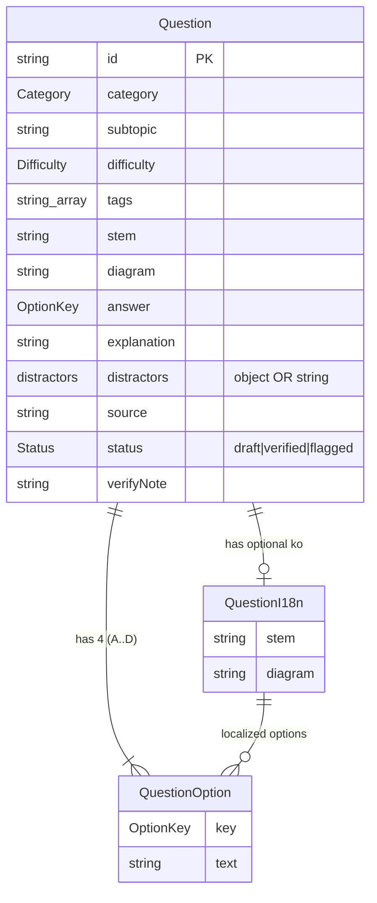

# 데이터 모델 & ERD (Data Model)

> 범위: o11-quiz의 모든 데이터가 사는 곳 — 리포지토리에 번들되는 문항 JSON 스키마, Supabase의 per-user 진도 테이블(RLS 포함), 게스트용 localStorage, 그리고 `src/lib/blueprint.ts`의 도메인 데이터 — 을 필드 단위 의미·제약과 함께 정리한다.

o11-quiz의 데이터는 두 층으로 뚜렷이 나뉜다. **콘텐츠(문항)** 는 읽기 전용 편집물로서 리포지토리의 `content/questions/*.json`에 버전 관리되어 앱에 번들되고(DB에 저장하지 않음), **per-user 진도(자기평가 status)** 만 Supabase Postgres(로그인 시) 또는 localStorage(게스트 시)에 저장된다. 이 분리는 의도된 설계 결정이다(brief §17-1: 문항은 git 리뷰/버전 관리 대상, DB는 사용자별 진도만 보관). 이 문서는 각 층의 스키마를 소스 파일 기준으로 서술한다.

---

## 1. 문항 JSON 스키마 (`content/questions/*.json`)

문항의 단일 진실 원본(source of truth)은 TypeScript 타입 `Question`(`src/types/question.ts`)이다. 문항은 subtopic별로 나뉜 14개 JSON 파일(`content/questions/*.json`)에 배열로 저장되고, 빌드 타임에 `scripts/gen-manifest.mjs`가 이를 모아 `src/generated/all-questions.ts`로 임포트한다. 이때 **`status === "verified"` 문항만 서빙**되고 `flagged`/`draft`는 리포지토리에 남되 제외된다(brief §3, §5).

### 1.1 필드 인벤토리

`src/types/question.ts`의 `Question` 인터페이스 기준.

| 필드 | 타입 | 필수 | 의미 / 제약 |
|---|---|---|---|
| `id` | `string` | ✔ | 안정적 고유 식별자, 예 `"AGG-001"`. subtopic 접두어 + 3자리. 저장된 status의 키로 쓰임(언어 무관 → 진도가 언어 독립적). |
| `category` | `Category` (union) | ✔ | 6개 최상위 시험 카테고리 중 하나(§1.2). 공식 O11 Detail Sheet 블루프린트와 일치. |
| `subtopic` | `string` | ✔ | 하위 주제 라벨, 예 `"Aggregates"`, `"Logic Flows & Exception Handling"`. 파일 분할·블루프린트 슬롯의 기준. |
| `difficulty` | `"easy" \| "medium" \| "hard"` | ✔ | 난이도. |
| `tags` | `string[]` | – | 선택. 세부 주제 태그, 예 `["join-types"]`, `["group-by","count"]`. |
| `stem` | `string` (Markdown) | ✔ | 문제 본문. `src/components/Markdown.tsx`(react-markdown + remark-gfm)로 렌더. 영어 base. |
| `diagram` | `string` (Markdown) | – | 선택. Markdown 표 또는 fenced code block(flowchart). 예: `"\| # \| Left Source \| Join type \| ... "`. |
| `options` | `QuestionOption[]` | ✔ | 보기 배열. 실제 뱅크는 4지선다(A~D). 각 원소는 `{ key, text }`. |
| `answer` | `"A" \| "B" \| "C" \| "D"` (`OptionKey`) | ✔ | 정답 키 하나(single answer). |
| `explanation` | `string` (Korean Markdown) | ✔ | 정답 해설. **한국어**이며 두 언어에서 공유됨(로컬라이즈 대상 아님). 비개발자 눈높이 서술 + "→ 정답 X" + "**왜 나머지는 아닌가**" 오답 근거 + 선택적 "참고 ·…" 박스(brief §12). |
| `distractors` | `Partial<Record<OptionKey,string>>` **또는** `string` | – | 선택. 오답 근거. **두 형식**(§1.4). |
| `source` | `string` | ✔ | 정답의 근거 출처(workbook 챕터 / 공식 doc). 예 `"Training Workbook 4 · Use Data → Aggregate your data (Group by)"`. 임포트 문항 508건에 backfill됨(brief §15A). |
| `status` | `"draft" \| "verified" \| "flagged"` | ✔ | 라이프사이클 상태(§1.5). `verified`만 서빙. |
| `verifyNote` | `string` | – | 선택. 검증 관련 메모. 실제 데이터에서 verified 문항은 대개 `""`. |
| `i18n` | `{ ko?: QuestionI18n }` | – | 선택. 한국어 렌더(§1.3). 타입 주석상 "미래의 한국어-원작 버전용(번역이 아님)"으로 예약. |

`QuestionOption` = `{ key: OptionKey; text: string }`.

### 1.2 `category` — 6개 union 값

`src/types/question.ts`의 `Category` 타입:

- `"Reactive Apps in OutSystems"`
- `"Data Modeling"`
- `"Fetching Data"`
- `"Logic"`
- `"UI Design"`
- `"Architecture & Security"`

이 순서는 `src/lib/blueprint.ts`의 `CATEGORY_ORDER`와도 일치한다.

### 1.3 `i18n.ko` 구조와 per-field fallback

`QuestionI18n` 인터페이스(모든 필드 선택):

```ts
interface QuestionI18n {
  stem?: string;
  options?: QuestionOption[];   // [{ key, text }] × 4 — 문자열 배열이 아님
  diagram?: string;
}
```

핵심 규칙:

- **로컬라이즈 대상은 `stem` / `options` / `diagram` 뿐**이다. `explanation`은 한국어 하나로 두 언어가 공유하며 `i18n`에 들어가지 않는다(brief §5).
- **per-field fallback**: 한국어 표시 시 `i18n.ko`에 해당 필드가 있으면 그 값, 없으면 영어 base를 쓴다. `localizeQuestion`(`src/lib/i18n.tsx`)이 담당. AGG-002 실제 데이터는 `i18n.ko.diagram`이 없어(diagram 자체가 없는 문항) `stem`/`options`만 번역되는 예이고, AGG-001은 `diagram`까지 한국어 표를 갖는다.
- **`options`는 반드시 `{key,text}` 객체 배열**이다. 과거 Day 2 임포트에서 `ko.options`를 문자열 배열로 저장해 빈 보기가 렌더된 버그가 있었고(`localizeQuestion`이 `{key,text}`를 기대), 수정·가드됨(brief §15, commit `5aca383`).

### 1.4 `distractors` — 두 형식

`distractors?: Partial<Record<OptionKey, string>> | string` — 오답 각각이 왜 틀렸는지를 담는 선택 필드이며, **두 가지 형식**을 허용한다.

1. **키별 객체 형식** (권장·다수): 오답 키마다 근거 문자열.
   ```json
   "distractors": {
     "A": "이건 Only With(Inner Join)일 때의 동작입니다.",
     "C": "방향이 반대입니다. 기준(왼쪽) Source는 Category가 아니라 Product예요.",
     "D": "Aggregate 조인은 전부×전부(카티션 곱)를 만들지 않고..."
   }
   ```
   (`content/questions/aggregates.json` AGG-001)

2. **단일 문자열 형식**: 전체 오답 근거를 한 덩어리 Markdown 산문으로.
   ```json
   "distractors": "A: Input Parameter 개수 제한 없음. B: 호출 규칙과 Function 속성은 무관. D: Function=Yes의 목적이 바로 Expression 사용 허용."
   ```
   (`content/questions/client-server-actions.json:472`)

> **주의(과거 버그)**: 문자열 형식 distractor를 `Object.entries()`로 순회하면 문자열이 문자 단위로 쪼개져 깨진 근거가 렌더된다. 이 버그는 수정·가드됨(brief §15, commit `28ea91a`). 렌더러는 두 형식을 구분해 처리해야 한다.

### 1.5 `status` 라이프사이클 (문항 편집 상태)

문항 자체의 편집 라이프사이클로, 사용자별 자기평가 status(§3)와는 완전히 별개다.

| 값 | 의미 | 서빙 여부 |
|---|---|---|
| `draft` | 작성 중/미검증 초안 | 제외 |
| `verified` | 검증 완료(다중 에이전트 리뷰 + adversarial 검증 + doc-grounded QA 통과) | **서빙됨** |
| `flagged` | 문제가 발견되어 보류. 리포지토리에 남되 서빙 제외 | 제외 |

- `gen-manifest.mjs`는 `verified`만 `all-questions.ts`로 내보낸다(brief §3).
- 현재 뱅크: **verified 710 + flagged 3**(brief §6). flagged 3건은 `content/questions/` 중 `role-based-security.json`, `logic-flows-exceptions.json`, `entities-data-types.json`에 각각 존재(Grep 확인).
- 알려진 flagged 예: **ENT-058**(속성 rename 시 물리 DB 동작을 공식 확인 전이라 보류; brief §15B, §18).

---

## 2. 서버 데이터 (Supabase Postgres)

`supabase/schema.sql`은 **사용자별 진도만** 저장한다(주석: "Stores per-user progress only; questions live in the app"). 세 테이블이 정의되어 있으나 실제로 활성 사용되는 것은 `question_status` 하나뿐이고, `answers`/`bookmarks`는 이전 설계의 잔재로 남아 있으나 **더 이상 사용되지 않는다**(brief §7, §17-3).

### 2.1 `public.question_status` (활성 — 자기평가 status)

문항당·사용자당 한 행. 사용자가 자기평가한 문항만 행이 생긴다.

| 컬럼 | 타입 | 제약 |
|---|---|---|
| `user_id` | `uuid` | `not null`, `references auth.users(id) on delete cascade` |
| `question_id` | `text` | `not null` (문항 `id`, 예 `"AGG-001"`) |
| `status` | `text` | `not null check (status in ('known','review'))` |
| `updated_at` | `timestamptz` | `not null default now()` |
| PK | | `primary key (user_id, question_id)` |

의미(schema.sql 주석 + brief §7):

- `status='known'` = **알아요**
- `status='review'` = **몰라요** (= "다시 볼 목록")
- **행 없음** = **미확인**(default)

세 상태는 상호배타적이고 사용자 주도이며, 정답 여부에서 추론하지 않는다. `known`/`review` 두 값만 존재하므로 "미확인으로 되돌리기"는 상태 컬럼 값이 아니라 **행 삭제**로 구현된다.

**RLS**: 테이블에 row-level security가 켜져 있고, 단일 정책이 `for all`(select/insert/update/delete 모두)에 적용된다.

```sql
alter table public.question_status enable row level security;
create policy "question_status is private to its owner"
  on public.question_status for all
  using (auth.uid() = user_id)
  with check (auth.uid() = user_id);
```

- `using (auth.uid() = user_id)` — 읽기/삭제/업데이트 대상 행을 본인 것으로 제한.
- `with check (auth.uid() = user_id)` — 삽입/수정 시 남의 `user_id`로 쓰는 것을 차단.
- Postgres가 per-user 격리를 강제하므로 cross-user 유출이 없다(brief §13).

### 2.2 `public.answers` (정의됨, 미사용)

전체 시도 이력을 위한 테이블이었으나, 자기평가 status 재설계로 **사용 중단**(brief §7, §17-3). 스키마는 참고용으로 남는다.

| 컬럼 | 타입 | 제약 |
|---|---|---|
| `id` | `bigint` | `generated always as identity primary key` |
| `user_id` | `uuid` | `not null references auth.users(id) on delete cascade` |
| `question_id` | `text` | `not null` |
| `chosen` | `text` | `not null default ''` |
| `correct` | `boolean` | `not null` |
| `subtopic` | `text` | `not null` |
| `category` | `text` | `not null` |
| `mode` | `text` | `not null` |
| `created_at` | `timestamptz` | `not null default now()` |

- 인덱스: `answers_user_question_idx on (user_id, question_id)`.
- RLS 동일 패턴: `for all using/with check (auth.uid() = user_id)`.

### 2.3 `public.bookmarks` (정의됨, 미사용)

⭐ 별표 북마크("나중에 다시 보기")용이었으나, `review` status로 대체되어 **사용 중단**(brief §7).

| 컬럼 | 타입 | 제약 |
|---|---|---|
| `user_id` | `uuid` | `not null references auth.users(id) on delete cascade` |
| `question_id` | `text` | `not null` |
| `created_at` | `timestamptz` | `not null default now()` |
| PK | | `primary key (user_id, question_id)` |

- RLS 동일 패턴.

> **참고**: brief §13은 세 테이블 모두 RLS가 걸려 있다고 명시하며 schema.sql이 이를 뒷받침한다. `answers`/`bookmarks`는 코드 경로(`src/lib/progress.ts`)에서 더 이상 호출되지 않고, `src/lib/storage.ts`의 대응 localStorage 함수도 함께 미사용(brief §4, §7). @concentrix.com 도메인 제한 트리거는 이 파일이 아니라 `supabase/restrict-domain.sql`(auth.users 트리거)에 있다.

---

## 3. localStorage 스키마 (게스트용)

로그인하지 않았거나 Supabase가 구성되지 않은 경우, 자기평가 status는 브라우저 localStorage에 저장된다. 구현은 `src/lib/status.ts`, Supabase↔localStorage 라우팅은 `src/lib/progress.ts`가 담당한다(brief §7).

- **키**: `"o11quiz.status.v1"` (상수 `KEY`, `src/lib/status.ts`)
- **형태**: `Record<string, QStatus>` — 문항 `id` → status 매핑. status가 없는(미확인) 문항은 키 자체가 없다.
  ```json
  { "AGG-001": "known", "FDS-012": "review" }
  ```
- **`QStatus` 타입**: `"known" | "review"` (`src/lib/status.ts`) — Supabase의 `status` check 제약과 동일한 두 값.

`src/lib/status.ts`가 제공하는 함수(모두 SSR 가드 `typeof window === "undefined"` 포함):

| 함수 | 동작 |
|---|---|
| `getStatusMap(): Record<string, QStatus>` | 전체 맵 로드. 파싱 실패 시 `{}`. |
| `setStatusLocal(id, status \| null)` | 한 문항 설정. `null`이면 키 삭제(→ 미확인). |
| `setStatusBulkLocal(entries[])` | 여러 문항 일괄 설정/삭제. |
| `clearStatusLocal()` | 키 전체 제거(진도 초기화). |

`progress.ts`의 데이터 레이어(`loadStatuses()→Map<id,QStatus>`, `setStatus(id, status|null)`, `setStatusBulk(entries)`, `clearStatuses()`)가 로그인+구성 시 Supabase `question_status`로, 아니면 이 localStorage 계층으로 라우팅한다(brief §7). 언어 토글 선호도 등 다른 localStorage 값(brief §11, `src/lib/i18n.tsx`)은 진도와 별개 키다.

> Mock 시험 점수는 어디에도 영구 저장되지 않는다 — **session-only**이며 status 변경만 위 경로로 persist된다(brief §8, §9, §17-3).

---

## 4. 블루프린트 도메인 데이터 (`src/lib/blueprint.ts`)

블루프린트는 공식 O11 Certification Detail Sheet의 주제 분포를 재현해 50문항 모의고사를 조립하기 위한 **정적 도메인 상수**다(코드일 뿐 DB/JSON 아님).

### 4.1 타입과 상수

```ts
interface SubtopicSpec { category: Category; subtopic: string; count: number; }
export const TOTAL_QUESTIONS = 50;
export const PASSING_SCORE = 35;   // 70%
```

`BLUEPRINT: SubtopicSpec[]`는 subtopic별 슬롯 수를 정의하며, `count`의 총합은 **50**이다. `src/lib/questions.ts`의 `assembleMockFrom(knownIds)`가 이 스펙에 따라 subtopic마다 `count`개를 뽑아 모의고사를 구성한다(brief §8: 이미 "알아요"인 문항은 de-prioritize).

### 4.2 subtopic 슬롯 (6 카테고리, 합계 50)

| Category | Subtopic | count |
|---|---|---:|
| Reactive Apps in OutSystems | Client Variables | 1 |
| Reactive Apps in OutSystems | Screen Lifecycle | 3 |
| Reactive Apps in OutSystems | Debugging and Monitoring | 2 |
| Data Modeling | Entities & Data Types | 4 |
| Data Modeling | Data Relationships | 2 |
| Fetching Data | Aggregates | 6 |
| Fetching Data | Fetching Data on Screens | 4 |
| Logic | Client and Server Actions | 2 |
| Logic | Form Validations | 4 |
| Logic | Logic Flows & Exception Handling | 5 |
| UI Design | Screen Widgets | 9 |
| UI Design | Blocks and Events | 4 |
| Architecture & Security | Modular Dependencies | 2 |
| Architecture & Security | Role-based Security | 2 |
| **합계** | | **50** |

- 블루프린트 슬롯 수(모의고사 구성용)와 실제 뱅크의 verified 재고 수는 다르다. 예: Aggregates는 블루프린트 6슬롯이지만 뱅크에는 138문항이 있다(brief §6). 재고가 슬롯보다 많은 subtopic에서 매번 다른 문항이 뽑힌다.
- `CATEGORY_ORDER`는 위 6개 카테고리를 표시 순서대로 나열한 배열로, Dashboard·조립 로직의 정렬 기준이 된다.

---

## 5. ERD

### 5.1 논리 스키마 — `Question` (JSON, DB 아님)

문항은 DB 테이블이 아니라 임베디드 JSON이지만, 구조 이해를 위해 논리 관계로 표현한다. `Question`과 그 값 객체들의 composition:



### 5.2 물리 테이블 — Supabase 진도 저장소

`auth.users`(Supabase 관리)와 진도 테이블의 관계. `question_status`만 활성이고 나머지 둘은 미사용(점선 개념). `question_id`는 문항 JSON의 `id`를 가리키는 **논리적 참조**일 뿐 DB FK가 아니다(문항이 DB에 없으므로).

```mermaid
erDiagram
    users ||--o{ question_status : "owns (RLS: auth.uid()=user_id)"
    users ||--o{ answers : "owns (UNUSED)"
    users ||--o{ bookmarks : "owns (UNUSED)"

    users {
        uuid id PK
    }
    question_status {
        uuid user_id PK_FK
        text question_id PK
        text status "check known|review"
        timestamptz updated_at
    }
    answers {
        bigint id PK
        uuid user_id FK
        text question_id
        text chosen
        boolean correct
        text subtopic
        text category
        text mode
        timestamptz created_at
    }
    bookmarks {
        uuid user_id PK_FK
        text question_id PK
        timestamptz created_at
    }
```

- `question_status.question_id` ↔ `Question.id`: 애플리케이션 레벨의 논리적 연결(§5.1의 `Question.id`). 코드에서 `loadStatuses()`가 반환한 `Map<id,QStatus>`를 문항 `id`로 조인한다(`src/lib/progress.ts`).
- 세 물리 테이블 모두 `on delete cascade`로 사용자 삭제 시 진도가 정리되고, 동일한 `auth.uid() = user_id` RLS 정책을 갖는다.

---

## 6. 알려진 공백 / 불확실성 (brief §18)

- **자동 테스트 부재**: `tsc`/build와 결정론적 `scripts/qa-check.mjs`(옵션/answer 정합, i18n.ko 객체 형태, distractor 형식, 얇은/외국어 해설, 중복 stem 검사) 외에 단위/e2e 테스트가 없다.
- **flagged 문항의 근거**: ENT-058은 속성 rename의 물리 DB 동작을 공식 확인 전이라 `flagged`로 보류 중(brief §15B). 뱅크 전체에 대한 인간 OutSystems 개발자 최종 리뷰는 아직 미완.
- **`answers`/`bookmarks` 테이블**: 스키마·RLS는 살아 있으나 런타임에서 미사용. 삭제하지 않고 남긴 상태이므로, 향후 정리 여부는 미결(brief §7, §17-3).
- **`i18n` 예약 의미**: 타입 주석은 `i18n`을 "미래의 한국어-원작 버전(번역 아님)"으로 기술하나, 실제 현행 데이터는 base(영어) stem/options의 한국어 렌더로 채워져 있다. 명명과 현재 용법 사이의 이 뉘앙스는 코드 주석과 실사용이 완전히 일치하지는 않는 지점이다.
