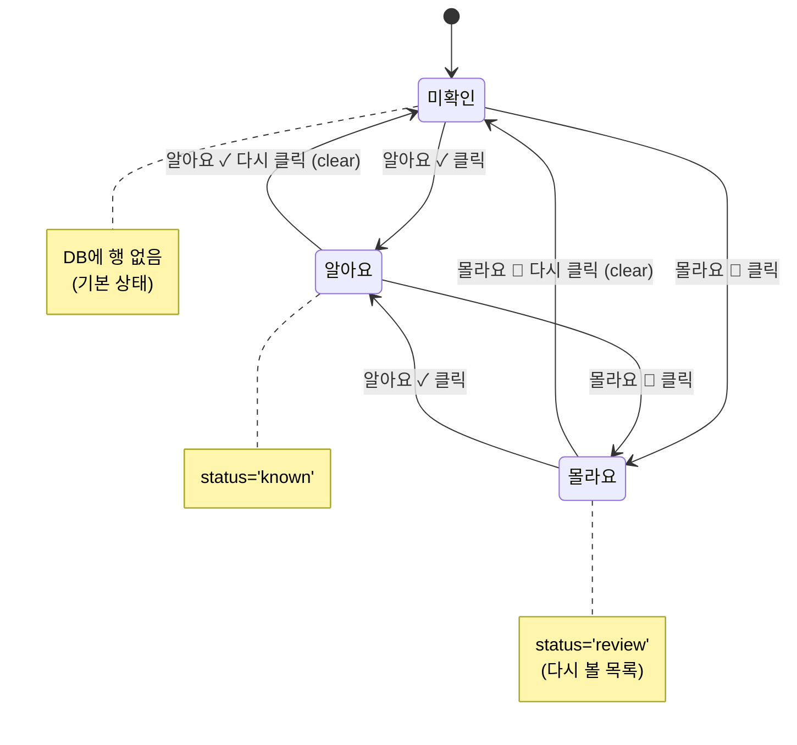
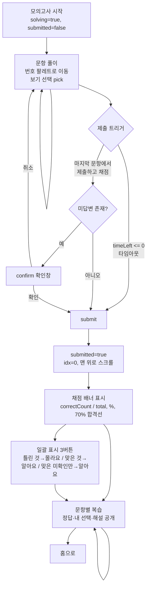
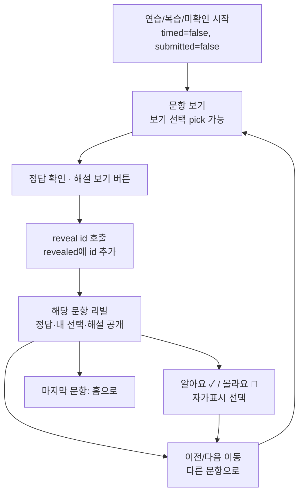
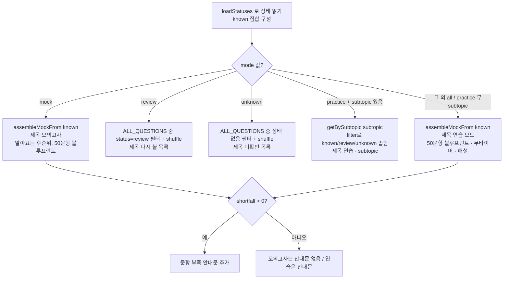
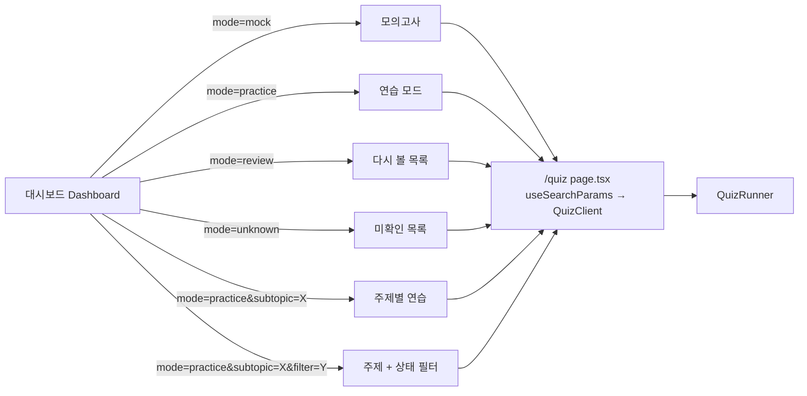

# 플로우 & 상태 다이어그램 (Flows & States)

> 범위: 문항 단위 자가평가 상태 전이, 퀴즈 모드별 생명주기(모의고사/연습), 모드 선택 결정 흐름, 대시보드에서 퀴즈로 진입하는 URL 경로 — `src/app/quiz/page.tsx`, `src/components/QuizClient.tsx`, `src/components/QuizRunner.tsx` 기준.

이 문서는 O11 Quiz 앱에서 사용자가 문제를 푸는 동안 화면과 데이터가 어떤 상태를 오가는지 정리한다. 크게 두 축이 있다. (1) **문항 하나의 자가평가 상태**(미확인/알아요/몰라요) — 사용자가 직접 토글하며, 정답 여부에서 자동 추론하지 않는다(brief §7). (2) **퀴즈 세션의 생명주기** — 모의고사(mock)는 블라인드 풀이 후 일괄 채점, 연습(practice)은 문항별 정답·해설 리빌 방식으로 갈라진다(brief §8, §9).

핵심 파일 역할:

| 파일 | 역할 |
| --- | --- |
| `src/app/quiz/page.tsx` | `useSearchParams`로 `mode`/`subtopic`/`filter`를 읽어 `QuizClient`에 전달. `<Suspense>`로 감쌈(Next.js 16 요구사항). |
| `src/components/QuizClient.tsx` | `mode`에 따라 문항 집합을 조립(assemble)하고 제목·안내문(note)을 결정. `loadStatuses()`로 상태를 읽어 mock 우선순위·필터에 사용. |
| `src/components/QuizRunner.tsx` | 풀이 + 복습을 하나로 처리하는 단일 문항 뷰 엔진. 타이머, 번호 팔레트, 리빌, 채점, 자가표시(mark), 일괄표시(bulk)를 담당. |
| `src/lib/progress.ts` | 자가평가 상태 데이터 계층. `loadStatuses`/`setStatus`/`setStatusBulk`. 로그인 시 Supabase, 아니면 localStorage로 라우팅(brief §7). |
| `src/lib/questions.ts` | `assembleMockFrom(knownIds)`, `getBySubtopic`, `shuffle`, `ALL_QUESTIONS`. |

---

## 1. 문항 자가평가 상태 전이

각 문항은 사용자·계정 단위로 딱 하나의 상태를 가진다. 상태값은 `src/lib/status.ts`의 `QStatus`(`"known" | "review"`)이며, **행이 없으면 미확인**이 기본이다(brief §7). 세 상태는 상호 배타적이고, 같은 버튼을 다시 누르면 미확인으로 되돌아간다(토글).

`QuizRunner.mark()`의 핵심 로직:

```ts
const next = statusMap.get(id) === s ? null : s; // 같은 값을 또 누르면 clear
```

즉 현재 상태와 누른 버튼이 같으면 `null`(미확인)로, 다르면 해당 상태로 바뀐다. 화면 상태(`statusMap`)를 먼저 갱신하고 `saveStatus(id, next)`로 영속화한다(낙관적 업데이트).



설명:
- **미확인 → 알아요/몰라요**: 문항 카드 하단의 `알아요 ✓` / `몰라요 🔖` 버튼으로 진입. 이 버튼은 **모든 모드·모든 상태에서 노출**되며(풀이 중인 mock 포함) 선택 사항이다. `QuizRunner`의 안내문이 이를 명시한다: 모의고사에서는 "지금 안 눌러도 돼요. 채점 후 위 '일괄 표시'로 …", 연습에서는 "진도·복습 목록에 반영돼요".
- **알아요 ↔ 몰라요 직접 전환**: 다른 상태 버튼을 누르면 곧바로 그 상태로 덮어쓴다(중간에 미확인을 거치지 않음).
- **알아요/몰라요 → 미확인**: 현재와 같은 버튼을 다시 눌러 clear(위 토글 로직).
- **영속화**: `known`은 진도(아는 문항), `review`는 대시보드 "다시 볼 목록(N)"에 집계된다. 미확인은 DB에 행이 없으므로 "미확인 목록"은 상태가 없는 문항들로 계산된다(`QuizClient`의 `unknown` 모드, `!statuses.get(q.id)`).

### 1-1. 일괄 표시(bulk)로 인한 상태 전이 — 모의고사 채점 후에만

모의고사를 제출·채점하면 채점 배너에 세 개의 일괄 버튼이 나타난다(`QuizRunner.bulk()`). 이는 여러 문항의 상태를 한 번에 바꾸며, `setStatusBulk(entries)`로 저장한다.

| 버튼 | 대상 조건 | 설정 상태 |
| --- | --- | --- |
| 틀린 것 → 몰라요 (`wrongReview`) | `chosen[q.id] !== q.answer` | `review` |
| 맞은 것 → 알아요 (`correctKnown`) | `chosen[q.id] === q.answer` | `known` |
| 맞은 미확인만 → 알아요 (`correctUnseenKnown`) | 정답 **AND** 기존 상태 없음(`!statusMap.has(q.id)`) | `known` |

세 번째는 이미 사용자가 직접 표시해 둔 상태를 덮어쓰지 않으려는 배려다(맞았지만 아직 미확인인 것만 알아요로). 대상이 하나도 없으면(`!entries.length`) 아무 것도 하지 않는다. 이 일괄 표시는 정답 여부를 상태로 "변환"하지만, 어디까지나 사용자가 버튼을 눌렀을 때만 일어나므로 자가평가 모델(사용자 주도, 자동 추론 금지)과 어긋나지 않는다.

---

## 2. 퀴즈 세션 생명주기 — 모의고사(mock)

모의고사는 **블라인드 풀이 → 제출 → 채점 → 복습**의 단방향 흐름이다. `mode === "mock"`이면 `timed = true`가 되고, `QuizClient`가 `timeLimitSec = 120 * 60`을 넘긴다(brief §8: 120분). 점수는 **세션 한정, 저장하지 않음**(brief §9).

주요 상태 변수(`QuizRunner`): `idx`(현재 문항), `chosen`(문항별 선택), `submitted`(제출 여부), `timeLeft`(남은 초), `statusMap`(자가평가). 파생값 `solving = timed && !submitted`가 "블라인드 풀이 단계"를 나타낸다.



설명:
- **풀이 단계(solving)**: 헤더에 `답변 N개`와 카운트다운 타이머(`⏱ m:ss`)가 보인다. 남은 시간이 60초 미만이면 타이머가 붉은색으로 바뀐다. 번호 팔레트 색은 답변함(짙은 slate)/현재(rose)/미답(연한 slate). 보기를 눌러도 정답은 공개되지 않는다(블라인드).
- **제출 경로 두 가지**: (1) 마지막 문항의 "제출하고 채점" 버튼 — 미답변이 있으면 `confirm(아직 N문항이 미답변입니다. 제출하고 채점할까요?)`로 재확인 후 진행. (2) 타이머가 0에 도달하면 `useEffect`가 자동으로 `submit()` 호출.
- **채점(`submit`)**: `submitted=true`, `idx=0`으로 리셋하고 맨 위로 스크롤. `correctCount`는 `chosen[q.id] === q.answer`인 문항 수, `pct = correctCount/total*100`, `passed = pct >= 70`. 배너에 합격선 통과/미달을 표시한다. (앱의 채점은 `total` 기준 70%이며, 실제 시험 블루프린트의 35/50과 개념적으로 대응한다 — brief §1.)
- **복습 단계**: 제출 후에는 모든 문항이 리빌 상태(`isRevealed = submitted || revealed.has(id)`)가 되어, 각 보기에 "← 정답"/"← 내 선택" 표기와 해설(`<details open>`)이 열린다. 번호 팔레트는 자가평가 색(알아요 green/몰라요 amber/미확인 slate)에 정오 배지(✓/✗)가 붙는다.

---

## 3. 퀴즈 세션 생명주기 — 연습(practice) 및 목록 모드

연습·복습·미확인 모드는 타이머가 없고(`timeLimitSec=undefined`, `timed=false`), **문항별로 리빌**한다. 제출·채점 개념이 없으므로 점수 배너나 일괄 표시가 뜨지 않는다.



설명:
- **리빌은 문항 단위**: `revealed`는 `Set<string>`으로, "정답 확인 · 해설 보기"를 누른 문항만 공개된다. 다른 문항으로 이동해도 이미 연 문항은 열린 상태가 유지된다. mock과 달리 한 번에 전체가 공개되지 않는다.
- **리빌 후**: 정답 보기는 emerald, 내가 고른 오답은 rose로 강조되고 해설이 열린다. 이후 `알아요/몰라요`로 자가표시할 수 있다(선택).
- **빈 목록 처리(`QuizClient`)**: `questions.length === 0`이면 모드별 안내를 띄운다 — `review`는 "다시 볼 문항이 없어요…", `unknown`은 "미확인 문항이 없어요… 👏", 그 외는 "이 조건에 해당하는 문항이 아직 없어요." 로딩 중(`questions === null`)에는 "불러오는 중…".

---

## 4. 모드 선택 결정 흐름 (QuizClient 조립 로직)

`QuizClient`는 `mode`(+`subtopic`, `filter`)를 받아 문항 집합·제목·안내문을 정한다. 먼저 `loadStatuses()`로 상태 맵을 읽고, `known` 집합을 만들어 mock 조립에 넘긴다.



설명(코드의 분기 순서 그대로):

| mode | 문항 집합 | 제목 | 특성 |
| --- | --- | --- | --- |
| `mock` | `assembleMockFrom(known).questions` | 모의고사 | 이미 "알아요"인 문항을 후순위로(모르는 것에 집중), 타이머 O |
| `review` | `ALL_QUESTIONS.filter(status==='review')` + shuffle | 다시 볼 목록 | 몰라요만 |
| `unknown` | `ALL_QUESTIONS.filter(상태 없음)` + shuffle | 미확인 목록 | 미확인만, 연습 안내문 |
| `practice` + `subtopic` | `getBySubtopic(subtopic)` + shuffle | 연습 · {subtopic}{상태접미사} | `filter=known/review/unknown`로 상태 좁힘 |
| 그 외(`all` 기본값, subtopic 없는 `practice`) | `assembleMockFrom(known).questions` | 연습 모드 | mock과 같은 50문항 블루프린트, 타이머 X, 해설 O |

주의할 점:
- **`page.tsx`의 기본 mode는 `"all"`**(`sp.get("mode") ?? "all"`). `all`은 `QuizClient`에서 명시 분기가 없어 마지막 `else`(연습 모드 블루프린트)로 떨어진다. subtopic 없는 `practice`도 같은 else로 합류한다.
- **mock과 연습 모드는 같은 `assembleMockFrom(known)`을 공유**한다(brief §8). 차이는 타이머 유무와 리빌 방식뿐이다. 두 경우 모두 `shortfall > 0`(은행 문항 부족)이면 "…문항으로 구성했어요" 안내문을 붙인다.
- **필터 접미사**: `known`→" · 🟢 알아요", `review`→" · 🟡 몰라요", `unknown`→" · ⚪ 미확인".
- 의존성 배열 `[mode, subtopic, filter]` — 이 값이 바뀌면 재조립한다. `loadStatuses()`는 이 effect 안에서 매번 다시 읽는다(쿼리 자동 재조회가 아니라 진입 시 명시 호출).

---

## 5. 대시보드 → 퀴즈 진입 경로

모든 진입은 `/quiz?mode=…&subtopic=…&filter=…` 형태의 URL 쿼리로 이뤄진다(brief §8, §10). `page.tsx`가 이를 파싱한다.

| 대시보드 요소(brief §10) | 이동 URL | 결과 모드 |
| --- | --- | --- |
| 모의고사 카드 | `/quiz?mode=mock` | 50문항 블루프린트, 120분 타이머 |
| 📖 연습 모드 카드 | `/quiz?mode=practice`(subtopic 없음) 또는 기본 진입 | 연습 모드(블루프린트, 무타이머, 해설) |
| 🔖 다시 볼 목록(N) 카드 | `/quiz?mode=review` | 몰라요 문항 |
| ⚪ 미확인 목록(N) 카드 | `/quiz?mode=unknown` | 상태 없는 문항 |
| 주제별 행 — 주제명 링크 | `/quiz?mode=practice&subtopic={이름}` | 해당 subtopic 전체 연습 |
| 주제별 행 — 카운트 배지(알아요/몰라요/미확인) | `/quiz?mode=practice&subtopic={이름}&filter={known\|review\|unknown}` | 해당 subtopic + 상태 필터 |



설명:
- **인증 게이트**: Supabase가 설정되어 있으면 `AuthGate`가 비로그인 사용자를 막는다(brief §4, §13). 진행 상태는 로그인 시 Supabase, 아니면 localStorage(`o11quiz.status.v1`)에 저장된다(brief §7).
- **0-count 배지**: 대시보드에서 카운트가 0인 상태 배지는 색은 유지하되 흐리게 처리되고 클릭 불가다(brief §10) — 빈 목록 화면으로 가는 것을 사전 차단.
- **Suspense 필요**: `useSearchParams`는 Next.js 16에서 `<Suspense>` 경계 안에서만 쓸 수 있어 `page.tsx`가 `QuizInner`를 감싼다(brief §3).

---

## 6. 알려진 격차 / 불확실성

- **점수 비영속**: 모의고사 점수는 세션 한정이며 어디에도 저장되지 않는다(`QuizRunner`는 저장 호출이 없음, brief §9). 새로고침하면 사라진다.
- **상태 저장 실패 처리 부재**: `mark`/`bulk`는 화면을 먼저 갱신하고 `saveStatus`/`setStatusBulk`를 `await`하지만, 저장이 실패했을 때 화면을 롤백하는 처리는 코드에 보이지 않는다(낙관적 업데이트만). 오프라인/네트워크 오류 시 화면과 저장소가 어긋날 수 있음 — 확인 필요.
- **자동 재조회 없음**: OutSystems와 마찬가지로(brief §16) 여기서도 쿼리가 자동 재조회되지 않는다. `loadStatuses()`는 `QuizClient`/`QuizRunner`의 effect 진입 시점에만 호출된다. 다른 탭에서 상태를 바꿔도 현재 세션에는 자동 반영되지 않는다.
- **테스트 부재**: 이 흐름들에 대한 단위/E2E 테스트는 없다(brief §18: `tsc`/build와 `qa-check.mjs`만 존재). 위 전이 표는 소스 코드 정독 기반이며 실행 검증은 별도.
- **`all` 모드의 의도**: `page.tsx` 기본값 `"all"`은 `QuizClient`에서 명시 분기 없이 연습 모드로 흡수된다. 의도된 별칭인지 잔재인지는 소스만으로 단정하기 어렵다.
