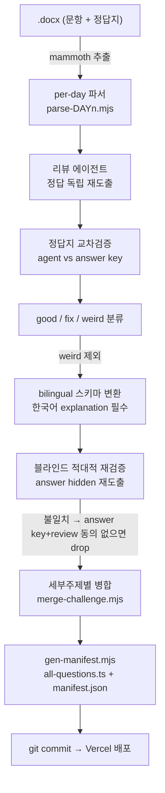

# 콘텐츠 파이프라인 & 방법론 (Content Pipeline)

> 범위: 710문항 O11 문제 은행이 어떻게 생성·임포트·QA·병합되었는가 — 멀티에이전트 초기 생성부터 콜리그 Day1~10 임포트, 워크플로우 엔지니어링 교훈까지.

이 문서는 O11 Quiz의 두 축 중 "콘텐츠 엔지니어링" 절반을 다룬다. 앱 코드가 아니라 **710개의 verified 문항이 만들어진 과정**이 대상이다. 최종 산출물은 `content/questions/*.json` (14개 세부주제 파일)이며, 이 JSON이 소스 오브 트루스다. 앱은 `scripts/gen-manifest.mjs`가 생성하는 `src/generated/all-questions.ts`를 통해 이 파일들을 자동 로드하고, `status === "verified"` 문항만 사용자에게 서빙한다.

콘텐츠는 DB가 아니라 **git으로 버전 관리되는 JSON**으로 리포에 번들된다(결정 로그 §17-1). 따라서 파이프라인의 모든 단계는 "리뷰 가능한 JSON을 생성/변형하는 작업"으로 귀결된다.

---

## 1. 전체 그림 — 두 시대(era)

문제 은행은 크게 두 시대에 걸쳐 만들어졌다.

| 시대 | 방식 | 산출 규모 | 근거 |
|---|---|---|---|
| **초기 생성 (pre-import)** | 손 저작 + 멀티에이전트 Workflow, 워크북 텍스트 기반, 적대적 3-검증 | ~156 verified | 브리핑 §14, 커밋 `18f83ae`~`6d0f9d6` |
| **콜리그 임포트 (the bulk)** | 시험 합격자가 공유한 ~650문항을 Day 1–10 단위로 파싱→리뷰→검증→병합 | 156 → 710 | 브리핑 §14, 커밋 `a9218fc`~`4fd35b1` |

두 시대 뒤에 전(全)은행 단위의 **3-계층 QA**(구조/근거/refresh 재스캔)가 겹쳐진다. 이 문서는 생성·임포트에 집중하고, QA 3계층은 §7에서 요약한다(상세는 QA 문서 별도).

---

## 2. 초기 생성 — 멀티에이전트 + 적대적 검증

첫 패스는 손 저작(hand-authored)과 멀티에이전트 Workflow의 혼합이었다. 커밋 타임라인(§19) 기준 순서:

1. `e521601` Workbook 4 기반 Aggregates 8문항으로 시작.
2. `2afb44e` / `c149be4` 도메인 다양성(Order/Product/Customer/Cart)·비주얼형 문항 추가.
3. `66a91f4` **도메인 다양성 규칙을 품질 기준(content quality bar)에 문서화** — `content/README.md`의 "도메인 다양성" 항목이 이때 확립.
4. `05f8b27` Screen Widgets 세부주제 추가(Workbook 3).
5. `73d381a` **첫 전체 패스: 14개 세부주제에 걸쳐 125 verified**.
6. `7de7a4b` / `6e48c35` 언어 토글 스켈레톤 + 전 문항 `i18n.ko` 한글 렌더 추가.
7. `6d0f9d6` 얇은(thin) 세부주제 top-up + 비주얼/플로우차트 문항 +29.

Workflow는 **워크북에서 추출한 텍스트로 그라운딩**된 ~156 verified 문항을 14개 세부주제 전체에 생성했다. 정확성은 **적대적 검증(adversarial verification)**으로 담보했다: 정답을 가린 채(answer hidden) **3개의 검증 에이전트**가 독립적으로 정답을 재도출하고 **다수결(majority vote)**로 합의했다. 이 원칙은 `content/README.md`의 저작·검증 프로세스에 그대로 코드화되어 있다:

- 1단계 **근거 수집** — 워크북 章 + 공식 문서에서 사실 추출.
- 2단계 **생성** — 추출된 사실만으로 `draft` 작성, 문항마다 `source` 명시.
- 3단계 **독립 검증** — 별도 패스가 정답키를 **안 보고** 출처에서 정답을 재도출 → 단일정답·오답타당성·근거·중복·유형쏠림 점검. 통과 시 `verified`, 불확실 시 `flagged` + `verifyNote`.
- 4단계 **스팟체크(나중)** — 앱 리뷰 화면에서 사람이 최종 검수.

품질의 정의(Definition of Done)는 `content/README.md`에 명시된 6개 축이다: 정확성(정답 정확히 1개 + 출처 검증 가능), 중복 없음, 유형 다양성(개념 참/거짓·부정형·시나리오·best-way·플로우 추적을 섞음), 실습·이론 조화, 도메인 다양성, 공식 샘플 20문항과의 시험 유사성.

---

## 3. 콜리그 임포트 — 156 → 710의 대량 확장

시험에 합격한 콜리그가 **Day 1–10에 걸친 ~650문항**을 두 개의 `.docx`로 공유했다(문항 본문 1개 + 정답지 1개). 이를 `mammoth`로 텍스트 추출한 뒤 **day 단위로** 처리했다.

핵심 난점은 **포맷이 Day마다 제각각**이었다는 점이다. 그래서 스크래치패드에 **per-day 파서**(`parse-*.mjs`)를 두어 각 Day의 포맷을 개별적으로 해체했다:

| 포맷 변형 | 예시 |
|---|---|
| `"Question N:"` + ABCD 라벨 | Day 초기 포맷 |
| `"N."` + 라벨 없는 옵션 | 번호만 있고 A/B/C/D 표기 없음 |
| True/False | 2지선다형 |
| inline options | 옵션이 한 줄에 이어짐 |
| labeled `"A) B)"` | 괄호형 라벨 |
| Day10 = 두 벌의 완전한 50-Q 시험 | 실제 mock 2세트 |

파서가 원시 `.docx` 텍스트를 중간 구조로 정규화하면, 그 뒤 **review→verify Workflow**가 붙었다.

### 3.1 하루치 파이프라인 (Mermaid)



### 3.2 각 단계 상세

- **리뷰 에이전트 (독립 도출)** — 에이전트들이 콜리그의 정답을 보지 않고 문항만으로 정답을 스스로 도출한다.
- **정답지 교차검증** — 도출한 정답을 **콜리그의 answer key와 대조**한다.
- **good / fix / weird 분류** — 각 문항을 셋으로 나눈다. `good`은 그대로, `fix`는 수정 후 채택, **`weird`는 제외**(모호하거나 포맷이 깨졌거나 시험 범위 밖).
- **bilingual 스키마 변환** — 채택 문항을 프로젝트의 Question 스키마로 변환하며 **한국어 `explanation`을 필수로** 작성한다(스키마는 §5 참조).
- **블라인드 적대적 재검증** — 정답을 가린 별도의 적대적 검증 에이전트가 채택된 각 문항의 정답을 **다시** 재도출한다. **불일치가 나면 answer key와 review가 모두 동의하지 않는 한 해당 문항을 drop**한다(보수적 채택 규칙).
- **병합** — 살아남은 문항을 세부주제별 파일로 합친다(`merge-challenge.mjs`).
- **gen + 배포** — `scripts/gen-manifest.mjs`가 `src/generated/all-questions.ts`(전 콘텐츠 파일 자동 import)와 `manifest.json`(대시보드용 카운트)을 재생성하고, `main`에 push하면 Vercel이 자동 배포한다.

> 주의: `parse-*.mjs`와 `merge-challenge.mjs`는 **스크래치패드의 일회성 스크립트**로, 리포에 커밋되지 않았다(브리핑 §14). 리포에 남은 파이프라인 스크립트는 `scripts/gen-manifest.mjs`와 `scripts/qa-check.mjs`뿐이다. 파서 목록·정확한 파일명은 커밋에 보존되지 않은 **알려진 공백**이다(브리핑 §18 정신에 따라 명시).

---

## 4. Day별 증분 — 커밋 타임라인 대조

Day 단위 임포트는 커밋 메시지에 은행 누적치가 기록되어 추적 가능하다(§19). 브리핑 §14의 Day 총계와 커밋을 대조하면:

| Day | 증분 | 커밋 후 누적 verified | 커밋 |
|---|---|---|---|
| Day 1 | +49 | — (첫 임포트) | `a9218fc` |
| Day 2 | +60 | 263 | `78aa4db` |
| Day 3 | +58 | 321 | `7a7e6f3` |
| Day 4 | +50 | 371 | `02cab06` |
| Day 5 | +72 | 443 | `d6fa1d1` |
| Day 6 | +47 | 639 | `872d4d3` |
| Day 7 · Fetch | +29 | 711 | `4fd35b1` |
| Day 7 · Aggregate | **스킵** | — | (§6) |
| Day 8 | +43 | 682 | `9c0d905` |
| Day 9 | +56 | 499 | `67ca916` |
| Day 10 | +93 | 592 | `a7b7b45` |

> 참고: 커밋 누적치는 **커밋 순서(작업 순서)** 기준이며 Day 번호 순이 아니다. 예를 들어 Day 10(+93, 592)·Day 9(+56, 499)가 Day 6(+47, 639)·Day 8(+43, 682)보다 먼저 커밋되었다. 즉 Day 번호는 **소스 문서의 날짜 구획**일 뿐, 임포트 처리 순서와 다르다. Day 7 Fetch(`4fd35b1`)에서 은행이 711에 도달하며 대량 임포트가 마무리되었고, 이 커밋에서 `source` 백필과 QA 체커(`qa-check.mjs`)가 함께 추가되었다.

임포트 도중 발견·수정된 데이터 버그 두 건도 커밋에 남아 있다:

- `5aca383` **Day 2의 빈 한국어 옵션** — `i18n.ko.options`가 `{key,text}` 객체가 아니라 문자열로 저장되어 UI에서 공란으로 렌더된 문제. (`qa-check.mjs`의 `ko-opt-string` 체크가 이 회귀를 감시한다 — line 59.)
- `28ea91a` **깨진 distractor 근거** — `distractors`가 문자열일 때 `Object.entries`로 순회하면 글자 단위로 쪼개지던 버그.

---

## 5. 산출물 스키마 & 게이트 (gen-manifest)

모든 Day 파이프라인의 출력은 §5 Question 스키마를 만족해야 한다(`src/types/question.ts`, `content/README.md`):

```jsonc
{
  "id": "AGG-001",          // 주제 접두사 고유 id (진도·통계 키)
  "category": "...",        // 6개 대분류
  "subtopic": "Aggregates", // 14개 세부주제
  "difficulty": "medium",
  "tags": ["join-types"],
  "stem": "질문 (영어, 마크다운)",
  "diagram": "...",         // GFM 표 또는 코드블럭 (선택)
  "options": [{"key":"A","text":"..."}, ...],  // 정확히 4개
  "answer": "B",
  "explanation": "정답 근거 (한국어 마크다운)",  // 두 언어 공유
  "distractors": {"A":"...", "C":"..."},        // 객체 또는 문자열 (선택)
  "source": "Workbook 4 · Use Data",
  "status": "verified",     // verified | flagged | draft
  "i18n": {"ko": {"stem":"...", "options":[{"key,"text"}], "diagram":"..."}}
}
```

id 접두사 규칙(`content/README.md`): AGG(Aggregates), LFE(Logic Flows & Exceptions), SW(Screen Widgets), BE(Blocks & Events), ENT(Entities), REL(Data Relationships), FV(Form Validations), CSA(Client/Server Actions), SL(Screen Lifecycle), CV(Client Variables), DBG(Debugging), FDS(Fetching on Screens), MOD(Modular Deps), SEC(Role Security).

**병합 후 게이트**는 `scripts/gen-manifest.mjs`가 담당한다:

- 전 `content/questions/*.json`을 읽어 **id 중복이면 `throw`**(line 26) — 파이프라인이 같은 id를 두 번 만들지 못하게 하드 페일한다.
- `status !== "verified"`는 카운트에서 제외하고 `flagged`로 집계(line 28–31) — `flagged` 문항은 리포에 남되 서빙되지 않는다.
- 세부주제별 `{category, count}`를 집계해 `manifest.json`으로 출력(대시보드가 가볍게 유지되도록).
- `all-questions.ts`를 자동 생성 — **새 콘텐츠 파일을 추가해도 수동 import가 필요 없다**(line 44–51). 이 덕분에 Day별 임포트가 파일만 떨어뜨리면 됐다.

`gen`은 `predev`/`prebuild`에서 자동 실행되므로, 병합→커밋→배포 사이에 항상 최신 매니페스트가 생성된다.

---

## 6. Day 7 Aggregate 스킵 결정 (ADR)

Day 7의 **Aggregate 부분은 의도적으로 임포트에서 제외**했다(브리핑 §14, 결정 로그 §17-5). 근거:

1. **소스 포맷이 지저분함** — 혼합 포맷(mixed format)이라 파스 리스크가 높았다.
2. **Aggregates가 이미 과잉 공급** — 현재 은행에서 Aggregates는 **138문항으로 최대 세부주제**다(§6 현황). 반면 블루프린트상 mock 1회에 6문항만 필요하다. 한계 가치가 낮았다.

즉 "높은 파스 리스크 × 낮은 한계 가치"의 조합이라 스킵이 합리적이었다. Day 7의 **Fetching 부분은 채택**되어 +29로 은행을 711까지 끌어올렸다(`4fd35b1`).

이 결정으로 최종 은행의 세부주제 분포가 블루프린트 수요와 반드시 비례하지는 않는다. 최대(Aggregates 138)와 최소(Client Variables 15)의 편차가 크며, 이는 콜리그 소스의 자연 분포를 따른 결과다. 일부 세부주제가 recall-heavy로 쏠린 점은 알려진 공백이다(브리핑 §18).

---

## 7. QA — 3-계층 (임포트 이후)

대량 임포트 뒤 전(全)은행 QA가 3계층으로 걸쳐졌다(브리핑 §15). 이 문서에서는 파이프라인 관점에서만 요약한다.

| 계층 | 도구 | 성격 | 결과 |
|---|---|---|---|
| **A. 구조/렌더링** | `scripts/qa-check.mjs` | 결정적, LLM 없음 | 최종 0 errors; `source` 508건 백필 |
| **B. 근거(grounding)** | 전-은행 Workflow (정답 재도출 + 독립 검증) | LLM 적대적 | 711 중 4 flag → FDS-062(C→D)·AGG-006 수정, ENT-058 flag 유지, BE-010은 false flag |
| **C. refresh 재스캔** | DOC-CORRECTED 사실로 110문항 타깃 패스 | LLM | auto-refetch false-negative 4건(AGG-106, FDS-021, FDS-038, FDS-075) 수정 |

**A계층 `qa-check.mjs`**는 파이프라인의 결정적 안전망이다. 검사 항목:

- 옵션 무결성 — 정확히 4개, A–D 키 존재, 빈 텍스트 없음, 라벨 누수(`A.`/`B)` 접두), 중복 옵션.
- `answer`가 A–D이고 실제 옵션 키와 매치.
- `explanation` — 존재·한국어 포함(`expl-not-korean`)·너무 얇음(`expl-thin`, 공백 제외 60자 미만)·오답 근거 부재 휴리스틱.
- `i18n.ko` — stem/options 존재, **옵션이 문자열이면 ERR**(`ko-opt-string`, §4의 Day 2 버그를 감시), 빈 옵션.
- stem 아티팩트 — `은주과장`·`확인필요`·`yourAns`·`answerKey`·`Question N:` 같은 파싱 잔재 탐지(line 71), 선두 번호(`stem-leading-number`).
- **베트남어 문자 탐지**(line 15의 `VI` 정규식, line 73) — 콜리그 소스에 섞인 외국어 오염을 잡는 안전장치.
- 세부주제 화이트리스트, `source` 존재, `status` 유효성, **중복 stem** 탐지.

`qa-check.mjs`는 LLM 없이 돌아가므로 임포트마다 반복 실행 가능한 회귀 게이트 역할을 한다. LLM 계층(B/C)이 잡는 것은 사실 정확성이고, 이 계층이 잡는 것은 **구조·렌더 무결성**이다 — 둘은 상보적이다.

> 근거 QA에서 드러난 교훈: 초기 에이전트/시드 신념이 OutSystems 사실에서 **세 번 틀렸다**(브리핑 §16). 대표적으로 On Ready 존재 부정, 쿼리 auto-refetch 오해, join 타입 개수 오류. 그래서 이후 개념 참조 박스는 **에이전트 생성 사실을 쓰지 않고**, 문서-검증된 고정 텍스트에 "어떤 개념이 적용되는가"만 분류하게 했다(결정 로그 §17-6).

---

## 8. 워크플로우 엔지니어링 교훈

대량 임포트를 돌리며 얻은, 재사용 가능한 멀티에이전트 워크플로우 운영 교훈(브리핑 §14):

1. **큰 데이터는 `args`가 아니라 스크립트에 임베드하라** — 4096개를 넘는 배열을 `args`로 넘기면 workflow VM 경계를 건드려 실패한다. per-day 데이터를 파서 스크립트 안에 직접 박아넣는 편이 안전했다.
2. **자립형(self-contained) 프롬프트** — 에이전트가 워크북을 과도하게 재읽기(over-reading)하지 않게 프롬프트를 자족적으로 구성하니 스톨(stall)이 사라졌다. 필요한 사실을 프롬프트에 넣어주는 편이 "가서 찾아 읽어라"보다 안정적이었다.
3. **`journal.jsonl`에서 결과 복구** — 실행의 반환값이 잘려(truncate) 돌아올 때는 저널 파일에서 결과를 복구했다. 대량 배치의 부분 실패에 대비한 복구 전략.

이 교훈들은 "생성 품질"이 아니라 "**대량 에이전트 배치를 실패 없이 완주시키는 운영**"에 관한 것이며, Day 1–10을 반복 처리하는 동안 축적되었다.

---

## 9. 알려진 공백 (정직한 기록)

브리핑 §18에 따라 명시한다:

- **파이프라인 스크립트 미보존** — `parse-*.mjs`, `merge-challenge.mjs`는 스크래치패드 일회성이라 리포에 없다. Day별 정확한 파서 로직은 재구성 불가.
- **자동 테스트 부재** — `tsc`/build + 결정적 `qa-check.mjs` 외에 unit/e2e 테스트가 없다.
- **ENT-058** — attribute-rename의 물리 DB 동작이 공식 검증 대기 중이라 `flagged` 유지.
- **최종 사람 검수 보류** — OutSystems 개발자에 의한 은행 전체의 최종 사람 리뷰(README 4단계 스팟체크)는 아직 미완.
- **세부주제 편중** — 콜리그 소스 분포를 따라 일부 세부주제가 recall-heavy로 쏠려 있고, 비주얼/스크린샷 문항 비중이 실제 시험(~45%)보다 낮다.
